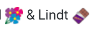

  
```{r echo=FALSE,warning=FALSE,include=FALSE}
library(tidyverse)
library(rvest)
```

The R blogosphere is an incredible place right now. From [R-Bloggers](https://www.r-bloggers.com/) to [R Weekly](https://rweekly.org/), there are dozens of posts produced daily on new methods and real world applications of R. When writing any blog my first question is what can this post add that hasn't already been said somewhere on the internet already? Blogs are often focused on new and exciting methodologies, visualisations or applications, answering interesting questions, yet very few focus on what we Data Scientists spend most of our time doing - data wrangling and cleaning. I would like to draw attention in this blog to some of the issues with real, messy websites, that the Rvest tutorials may not mention, and how I chose to approach these difficulties when mining conversations from Mumsnet.

#Scraping a Mumsnet Conversation

A Mumsnet conversation consists of a number of posts split over many pages. The conversation is started by one user and their initial post is at the top of every page. Each post has a username, date-time stamp and the content of the post. Thus on first appearance, scraping posts is relatively straightforward using Rvest:

```{r echo=TRUE,eval=FALSE}

    conv = read_html(uri, encoding = "UTF-8")
    users1=html_nodes(conv,'.nickname')%>%
      html_text() 
    time1=html_nodes(conv,'.post_time')%>%
      html_text() 
    posts1 = html_nodes(conv,'.talk-post.message')%>%
      html_text() 
    
    df = data.frame(date = time1,user = users1,text=posts1,stringsAsFactors=FALSE)

```

For each page of the conversation, we can read every nickname, post time and message and then combine them in a data frame. However, while this works fine for the nickname and post time, **html_text()** ignores all html coding in the text, which means that while we think we are scraping everything, we miss out on important information.

## emojis

Emojis are an important means of communication on internet chatboards. The html_text() function does not scrape them, so another method needs to be used. There are different approaches that can be taken. For some, it may be considered useful to just know an emoji exists in a post at all, and therefore emojis can be scraped into a separate vector. To do this we look for **img** tags with an **alt** attribute - only emojis have these.

```{r echo=TRUE,eval=FALSE}
    emo<-function(bl){
      html_nodes(bl,'img')  %>% 
        html_attr('alt',default='')}
    
    emojis = html_nodes(conv,'.talk-post.message') %>% 
                                        map(emo) %>% 
                                        map(paste,collapse=' ') %>% 
                                        unlist()

```

We can then use the map function from the purrr package to create a list of the emojis in every single post. This can then be converted back to a vector and added to a data frame with the nickname, time and text.

However, in some case this might not be sufficient. Emojis are often used as part of speech.

<div style="width:800px; height:20px">


It will enhance our textual analytics to keep them in their position in the text. 

##Links

Mumsnet users often share links to websites with eachother. These are useful to record, particularly when studying political discussion, to understand what outside links are of interest and being shared. In this case, there is no need for it to be included inside the text, so we can use a similar method for getting the emojis, this time looking for links and pulling out the **href** attribute:

```{r echo=TRUE,eval=FALSE}

    hr<-function(bl){
      html_nodes(bl,'a[target=\"_blank\"]')  %>% 
        html_attr('href',default='')}
    
      hrefs = html_nodes(conv,'.talk-post.message') %>% 
                                            map(hr) %>% 
                            map(paste,collapse=',') %>% 
                                       unlist()

```

## Formatting

Regular users of Mumsnet have developed conversation etiquette that relies on formatting. They may refer to another poster by their nickname, putting that nickname in bold or italic. They may also quote from a previous post, or link, and indicate this is a quote by using bold or italic. Without this formatting, a post can be attributed to the incorrect author. It is imperative that this formatting is retained for subsequent data cleaning purpose.

There are different approaches that could be taken for this. The first is just to read all text with all the html code in it: 

```{r echo=TRUE,eval=FALSE}

posts1 = html_nodes(conv,'.talk-post.message')  %>% 
                              map(as.character) %>% unlist()

```

This can then be cleaned subsequently using text processing methods. This is an inelegant and risky method, but the most straightforward solution. I asked this in [StackOverflow](https://stackoverflow.com/questions/50834186/r-rvest-keeping-italics-in-text-when-scraping) and was given an example of how to extract each set of formatting. For example if extracting just bold text:

```{r echo=TRUE,warning=FALSE,include=FALSE}
library(XML)

txtNode <- "<i>Hello</i> Mumsnet <b>World</b>"
html <- htmlParse(txtNode)
html

lNode <- getNodeSet(html, "//b")
lNode

```

Similar to the emojis, this method is useful for gathering and analysing formatted text, but less helpful for appreciating its importance within the context of the complete post.

## What is still missing?

In this post I've outlined the specific issues to Mumsnet posts that can be dealt with by some careful extraction in the data scraping process. But there are other issues to be aware of. One of the greatest difficulties is the use of pictures or memes within conversations. These often have no indication in their titles as to what they are. The simplest thing is to ignore them and be aware that something is missing in the data. Another option is to record their existence in another column, so we can potentially use this knowledge to subsequently filter our data when analysing.

Another important reference point is tweets. Mumsnet users often quote tweets, but they do not embed them in their post, just copy the text of the tweet with the author. These are sometimes included in italics but are often indecipherable from the rest of the text. There is not a lot that can be done about these quoted tweets when scraping, but they can be highlighted or removed when subsequently data cleaning.

# Conclusion

There is a reason people don't usually write blogposts on data cleaning - like the work itself, it is difficult to present a positive, coherent narrative. However, it is a disservice to Data Science to suggest that our work is all nifty algorithms and spectacular visualisations when our day to day challenge is often converting real-world data into something that can be analysed. This requires no less skill or original thought and our challenge is to communicate the tips, tricks and workflows that got us there.

