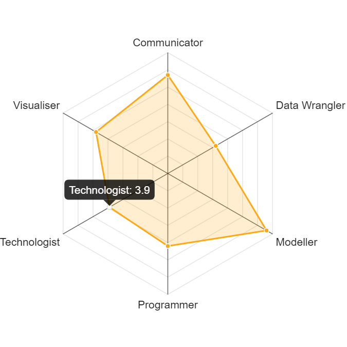
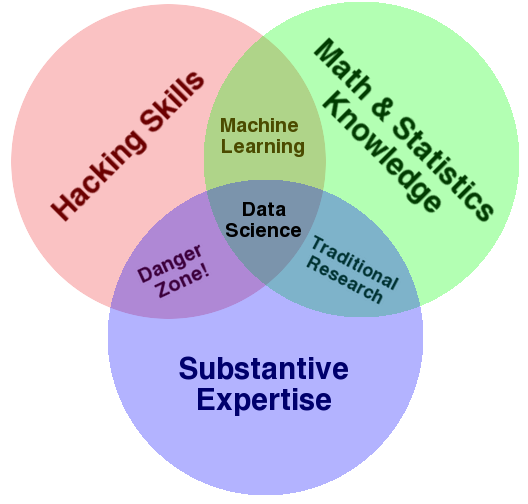

In a recent interview on [Dataframed](https://www.datacamp.com/community/podcast/text-mining-nlproc) podcast, [Julia Silge](https://juliasilge.com/), spoke of her background in Observational Astronomy and how applicable it was in Data Science. Later she gave a good explanation of her work in textual analytics and how it differs from Natural Language Processing, again as a method for observation rather than prediction. I found her use of wording interesting and thought it should have some credence in every data scientists' favourite debate "What is a Data Scientist?"

The "What is a Data Scientist?" debate, appears to still rage, despite seemingly having run its course some years ago. I am reluctant to wade in to this over argued area, but I hope I have a new, unifying approach to this divisive topic, that could take it in a different direction. I think the problem with defining a *Data Scientist* is that we think of it as a job title like Software Engineer or Product Manager. Yet many Data Scientists come from an academic background (PhD or post-doc) and Data Science skills are often an even balance of academic techniques with business and communication skills. We restrict our definition of a Data Scientist in terms of narrow lists of technologies and skillsets. These narrow requirements create the unicorn myth - we want Data Scientists who can uniformly do more things then they are humanly able. 

I think a mistake in these debates and definitions is that we think only in singular professional terms, a job must therefore fulfill some physical, tangible purpose. Yet maybe Data Scientist isn't a term for one job at all, but an umbrella term for professionals who have a subset of a certain group of skills. [Mango Solutions](https://www.mango-solutions.com/) have helped create this narrative with their [Data Science Radar tool](https://www.mango-solutions.com/radar/) which defines which of the Data Science skills are your strong point and creates a narrative that no-one can excel in all these skills at once. In the most recent DataCamp [podcast](https://www.datacamp.com/community/podcast/building-data-science-teams), Drew Conway is quoted to say "Data Science is not about finding one person who does everything. It's about finding a group of people who know a lot about some parts of it, and can work together."

  
  

I believe the next step forward as Data Science reaches maturity, is to move away from the umbrella term Data Science and think a bit more about what it means and the different roles within it. We can start by thinking about the etymology of this job title we all claim: "Data Scientist" - a scientist of data. What types of scientists are there? Like Julia, there are observational scientists where there are no experiments, but the secrets of nature are observed and insights learned from studying what is around us. In Data Science this can be in Exploratory Data Analysis, Textual Analytics and even effective visualisations. Some see this work as a precursor to 'more important' predictive analytics, but for many projects and clients, the insight provided from this exploratory deep diving into data is the key gain to making better business decisions. The scientist is providing discoveries about their data which were previously unknown.

An experimental Data Scientist may work more on statistical experiments. They might be running A/B tests and developing predictive models. Of course, like all coarse definitions, no Data Scientist falls into each group rigourously, there are crossovers and of course the many other unicorn skills that make a Data Scientist that are important too. Like Astronomy started as one field and subdivided into specialities, there will be shades of grey and crossovers with other sciences and departments too eg software engineering or social sciences.

At the start of this decade, Drew Conway's now famous [Venn Diagram](http://drewconway.com/zia/2013/3/26/the-data-science-venn-diagram) was fundamental to help everyone understand what on earth Data Science was, in 2018 we need a more nuanced approach to defining what we do. We need to appreciate that in the same way that Experimental Astronomers and Observational Astronomers are all called Astronomers, Data Scientists can fulfill very different roles and fit under the wide tent that Data Science has become. A Paediatrician, a rheumatologist and a Pathologist are all called Doctors, despite doing very different jobs. Perhaps the Data Science field is now mature enough to stop asking "are you a Data Scientist", but "what type of Data Scientist are you?"

  
  

